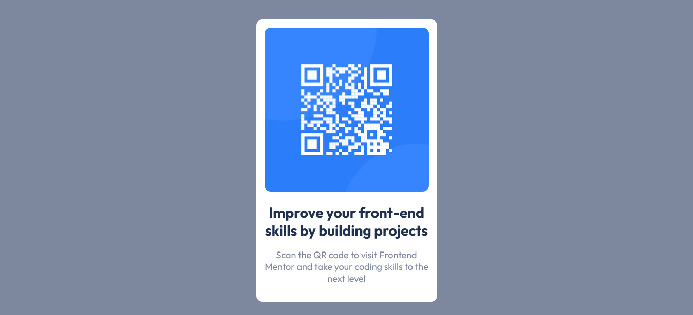

# Frontend Mentor - QR code component solution

This is a solution to the [QR code component challenge on Frontend Mentor](https://www.frontendmentor.io/challenges/qr-code-component-iux_sIO_H). Frontend Mentor challenges help you improve your coding skills by building realistic projects.

## Table of contents

- [Overview](#overview)
  - [Screenshot](#screenshot)
  - [Links](#links)
- [My process](#my-process)
  - [Built with](#built-with)
  - [What I learned](#what-i-learned)
- [Author](#author)

## Overview

This is the finished design of the challenge on the QR code component
solution.

### Screenshot



### Links

- Solution URL: [github](https://github.com/Flashdaniel/qr-code-component-main)
- Live Site URL: [Qr code component](https://qr-code-component3013.netlify.app/)

## My process

### Built with

- Semantic HTML5 markup
- CSS
- Mobile-first workflow

### What I learned

I used CSS Grid to make sure that the attribution always stays at the bottom of the page.

```html
<div class="attribution">
  Challenge by
  <a href="https://www.frontendmentor.io?ref=challenge" target="_blank"
    >Frontend Mentor</a
  >. Coded by <a href="#">Your Name Here</a>.
</div>
```

```css
body {
  display: grid;
  grid-template-columns: 1fr;
  grid-auto-rows: 1fr 1fr;
  justify-items: center;
}

.attribution {
  font-size: 1.4rem;
  padding: 4rem 1rem;
  align-self: end; /* to the bottom of the page */
}
```

## Author

- Frontend Mentor - [@Flashdaniel](https://www.frontendmentor.io/profile/Flashdaniel)
- Linkedin - [@Nweze Daniel](https://www.linkedin.com/in/daniel-nweze-017909214/)
